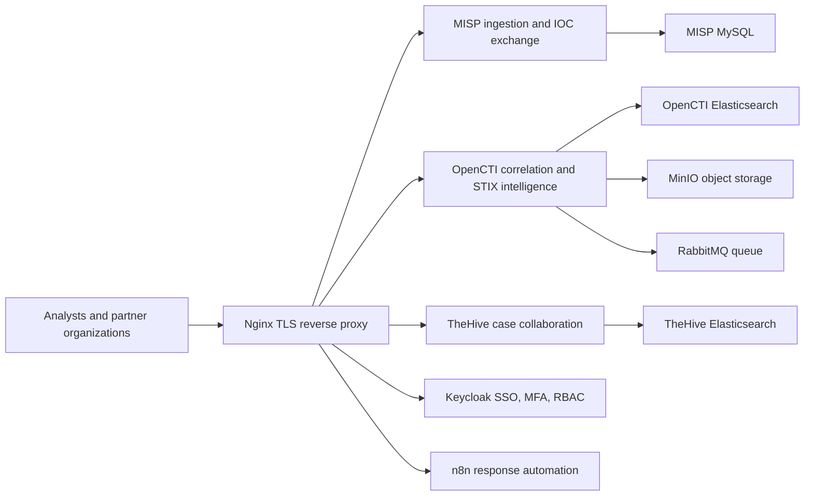

# SentinelMesh Production Readiness Runbook

This runbook describes how to operate SentinelMesh as a production-grade deployment. The repository is submission-ready as a validated academic project package, but a real production launch must still be completed with real DNS, TLS certificates, generated secrets, backup storage, monitoring, and live acceptance testing.

## Production Architecture

The production overlay exposes the platform through a single reverse proxy and keeps application services on internal Docker networks.



## Minimum Launch Prerequisites

- Docker Engine with Docker Compose V2.
- A Linux or Windows host with at least 8 CPU cores, 32 GB RAM, and 250 GB SSD for a serious multi-service demo. Production sizing should be based on IOC volume, retention, and organization count.
- DNS records for `misp.<domain>`, `opencti.<domain>`, `thehive.<domain>`, `auth.<domain>`, and `n8n.<domain>`.
- TLS certificate and private key stored as:
  - `tisp-infra/certs/fullchain.pem`
  - `tisp-infra/certs/privkey.pem`
- A private `.env.prod` generated from `.env.prod.example`.
- A documented administrator list, organization list, and data sharing agreement signed before onboarding real participants.

## Production Setup

From `tisp-infra`:

```powershell
.\generate-secrets.ps1
notepad .env.prod
```

Replace `TISP_DOMAIN=example.org` with the real domain and confirm the administrator email values are correct.

Validate secrets and Compose output:

```powershell
.\validate-env.ps1 .env.prod -Profile prod
docker compose -f docker-compose.yml -f docker-compose.prod.yml --env-file .env.prod config
.\validate-prod-compose.ps1 .env.prod
.\validate-images.ps1 .env.prod -Production
```

Deploy only after the validation passes:

```powershell
docker compose -f docker-compose.yml -f docker-compose.prod.yml --env-file .env.prod up -d
docker compose -f docker-compose.yml -f docker-compose.prod.yml --env-file .env.prod ps
```

Run the post-deploy smoke test:

```powershell
.\smoke-test.ps1 -Domain your-domain.example
```

Use `-SkipCertificateCheck` only for an internal test with temporary certificates.

## Security Controls

- Enforce TLS for all user-facing services through the reverse proxy.
- Do not publish internal service ports in production; use the reverse proxy hostnames.
- Generate unique secrets with `generate-secrets.ps1`; never commit `.env.prod`.
- Enable MFA in Keycloak before onboarding partner users.
- Create Keycloak groups for platform roles such as `TISP-Admin`, `SOC-Analyst`, `Org-Contributor`, `Read-Only-Partner`, and `Auditor`.
- Mirror the same role model inside MISP, OpenCTI, TheHive, and n8n.
- Disable or rotate bootstrap administrator credentials after first setup.
- Restrict direct Docker host access to platform administrators only.
- Lock container image versions or digests before real production exposure.
- Review platform audit logs weekly and after every onboarding or privilege change.

## Data Governance

Before accepting real intelligence data:

- Approve the data sharing agreement and privacy policy with every participant.
- Define TLP handling rules and enforce them in MISP/OpenCTI marking definitions.
- Document allowed data classes: IOCs, YARA rules, malware metadata, incident notes, and case artifacts.
- Prohibit raw personal data unless a documented lawful basis and retention period exist.
- Anonymize source identity where partner identity disclosure is not required.
- Keep retention windows aligned with GDPR, ISO 27001 control expectations, and the NIST Cybersecurity Framework process mapping in the project deliverables.

## Backup Procedure

Run volume backups from `tisp-infra`:

```powershell
.\backup-volumes.ps1 -ComposeProjectName tisp-infra
```

Store backups outside the application host, preferably encrypted and access-controlled. Keep at least:

- Daily backups for 7 days.
- Weekly backups for 4 weeks.
- Monthly backups for 6 months, if project policy requires long retention.

Restore testing must be performed on a separate host before relying on the backup plan.

## Monitoring And Operations

- Review `docker compose ps` daily during active project demonstrations.
- Send reverse proxy and application logs to a central log store for real deployments.
- Track failed logins, privilege changes, API token creation, feed import failures, and unusual export volume.
- Keep a monthly patch window for container image updates and platform version testing.
- Keep an incident contact list for each participating organization.

## Go-Live Decision

The system is ready for a controlled live pilot only when:

- Production Compose config validates with `.env.prod`.
- DNS and TLS are working for all five hostnames.
- MFA and RBAC are configured and tested with at least two organizations.
- STIX/TAXII import/export is tested with sample data.
- MISP, OpenCTI, TheHive, Keycloak, and n8n all pass smoke tests.
- Backup and restore have been tested on non-production infrastructure.
- Governance documents are approved by participating organizations.
